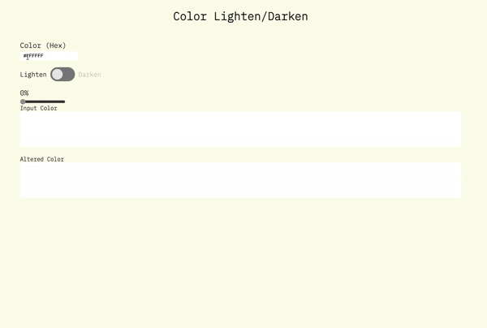

# color tool, lighten or darken
- A simple color tool in Vanilla JavaScript
- Built with HTML, CSS and JavaScript

---------

### JS concepts covered:
  - DOM manipulation
  - HEX and RGB colors
  - Creating a custom toggle button
